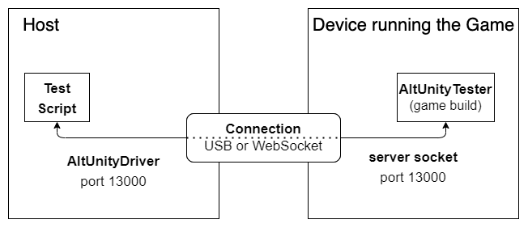
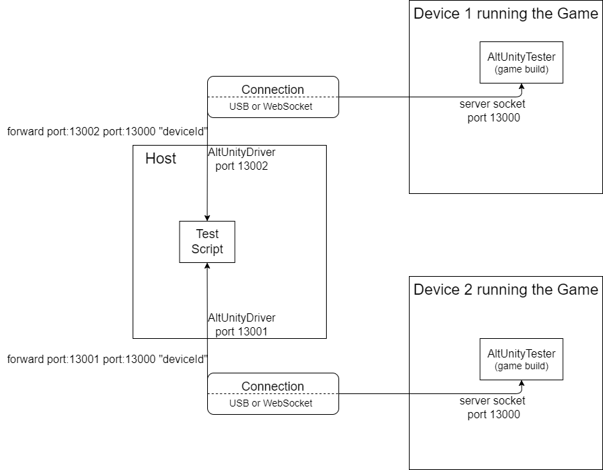
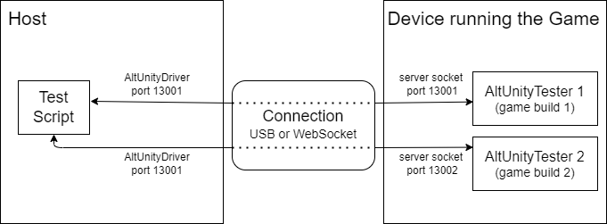

# Advanced Usage
## Build games from the command line

To build your Unity application from command line you need a static method in your project that handles the build logic.  
To instrument your Unity application with AltUnity Tester, your build method must define `ALTUNITYTESTER` scripting symbol and must insert AltUnity Prefab in the first scene of the game.

Depending on your project's setup, there are two ways in which games can be built from the command line:

```eval_rst
.. note::

    AltUnity Tester does not work by default in release mode. If you instrument your game in release mode, AltUnity Prefab self removes from the scenes and the socket server does not start. Best case practice is to customize your build script to insert AltUnity Prefab only in Debug mode. If you do want to use AltUnity Tester in release mode see `Using AltUnity Tester in Release mode section <#using-altunity-tester-in-release-mode>`_.
```

**1. If you already have a custom build method for your game**  

If you already have a custom build method for your game, you can add the following two lines to your build method:
```
var buildTargetGroup = BuildTargetGroup.Android;
AltUnityBuilder.AddAltUnityTesterInScritpingDefineSymbolsGroup(buildTargetGroup);
if (buildTargetGroup == UnityEditor.BuildTargetGroup.Standalone)
    AltUnityBuilder.CreateJsonFileForInputMappingOfAxis();
var instrumentationSettings = new AltUnityInstrumentationSettings();
AltUnityBuilder.InsertAltUnityInScene(FirstSceneOfTheGame, instrumentationSettings);
```

```eval_rst
.. note::

    Change `buildTargetGroup` above to the target group for which you are building.
```

**2. If you create a new custom build method for your game** 

The following example script can be used.  
It sets all the project settings needed and uses the same two important lines from point 1 above.

This example method is configured for the Android platform, so make sure to update it based on your target platform.
 
```eval_rst
.. include:: other~/build-from-command-line.txt
    :code: c#
    
```

The following command is used to call the build method:

```eval_rst
.. code-block:: bash

    <UnityPath>/Unity -projectPath $CI_PROJECT_DIR -executeMethod BuilderClass.BuildFromCommandLine -logFile logFile.log -quit
```
 
You can find more information about the build command and arguments [here](https://docs.unity3d.com/Manual/CommandLineArguments.html).  

```eval_rst
.. note::
    After building from the command line you can run the tests by using the commands from the `next section <#run-tests-from-the-command-line>`_.
```

## Run tests from the command line

In order to run tests from the command line you can use the following example commands:

```eval_rst
.. tabs::

    .. tab:: C#

        .. code-block:: bash

            <UnityPath>/Unity -projectPath $PROJECT_DIR -executeMethod AltUnityTestRunner.RunTestFromCommandLine -tests MyFirstTest.TestStartGame -logFile logFile.log -batchmode -quit
    
    .. tab:: Java

        .. code-block:: bash

            mvn test

    .. tab:: Python

        .. code-block:: bash

            python <nameOfYourTestFile.py>
```

## Run tests on a Continuous Integration Server

1. Instrument your game build with altUnity Tester from Unity or by [building from the command line](#build-games-from-the-command-line).
2. Start the game build on a device.
3. Run your tests - see commands in the ["Run tests from the command line" section](#run-tests-from-the-command-line).

An example CI configuration file can be viewed in the [AltUnity Tester GitLab repository](https://gitlab.com/altom/altunity/altunitytester/-/blob/master/.gitlab-ci.yml).


## What is port forwarding and when to use it

Port forwarding, or tunneling, is the behind-the-scenes process of intercepting data traffic headed for a computer’s IP/port combination and redirecting it to a different IP and/or port.

When you run your game instrumented with AltUnity Tester, on a device, you need to tell your AltUnity Driver how to connect to it. 

Port forwarding can be set up either through a command line command or in the test code by using the methods available in AltUnity classes.

The following are some cases when Port Forwarded is needed:
1. [Connect to the game running on a USB connected device](#connect-to-the-game-running-on-a-usb-connected-device)
2. [Connect to multiple devices running the game](#connect-to-multiple-devices-running-the-game)

### How to setup port forwarding

Port forwarding can be set up in three ways:
* through a command line command (using adb / IProxy) or 
* in the test code by using the methods available in AltUnity classes.
* from AltUnity Tester Editor - Port Forwarding Section


All methods listed above require that you have ADB or iProxy installed. 

For installing ABD, check `this article <https://developer.android.com/studio/command-line/adb>`_ for more information on ADB. 

For installing iProxy ``brew install libimobiledevice``. _Requires iproxy 2.0.2_


```eval_rst
.. tabs::

    .. tab:: Command Line

        .. tabs::

            .. tab:: Android

                - Forward the port using the following command: 

                    ``adb [-s UDID] forward tcp:local_port tcp:device_port``

                - Forward using AltUnity Tester Editor
                    
                    click on the refresh button in the Port Forwarding section in the Editor to see connected devices and then select the device to forward

            .. tab:: iOS

                - Forward the port using the following command: 

                    ``iproxy LOCAL_TCP_PORT DEVICE_TCP_PORT -u [UDID]``

                - Forward using AltUnity Tester Editor
                    
                    click on the refresh button in the Port Forwarding section in the Editor to see connected devices and then select the device to forward


    .. tab:: C#

        .. tabs::

            .. tab:: Android

                Use the following static methods (from the AltUnityPortForwarding class) in your test file:
        
                    - ForwardAndroid (int localPort = 13000, int remotePort = 13000, string deviceId = "", string adbPath = "")
                    - RemoveForwardAndroid (int localPort = 13000, string deviceId = "", string adbPath = "")
            
                Example test file:

                    .. include:: other~/test-files/csharp-Android-test.cs
                        :code: c#

            .. tab:: iOS

                Use the following static methods (from the AltUnityPortForwarding class) in your test file:
        
                    - ForwardIos (int localPort = 13000, int remotePort = 13000, string deviceId = "", string iproxyPath = "")
                    - KillAllIproxyProcess ()

                Example test file:
            
                    .. include:: other~/test-files/csharp-iOS-test.cs
                        :code: c#

    .. tab:: Java

        .. tabs::

            .. tab:: Android
            
                Use the following static methods (from the AltUnityPortForwarding class) in your test file:
        
                    - forwardAndroid (int localPort = 13000, int remotePort = 13000, string deviceId = "", string adbPath = "")
                    - removeForwardAndroid (int localPort = 13000, string deviceId = "", string adbPath = "")
            
                Example test file:

                    .. include:: other~/test-files/java-Android-test.java
                        :code: java

            .. tab:: iOS

                Use the following static methods (from the AltUnityPortForwarding class) in your test file:
        
                    - forwardIos (int localPort = 13000, int remotePort = 13000, string deviceId = "", string iproxyPath = "")
                    - killAllIproxyProcess ()

                Example test file:

                    .. include:: other~/test-files/java-iOS-test.java
                        :code: java

    .. tab:: Python

        .. tabs:: 
            
            .. tab:: Android

                Use the following static methods (from the AltUnityPortForwarding class) in your test file:
        
                    - forward_android (local_port = 13000, device_port = 13000, device_id = "")
                    - remove_forward_android (local_port = 13000, device_id = "")
            
                Example test file:
            
                    .. include:: other~/test-files/python-Android-test.py
                        :code: py

            .. tab:: iOS

                Use the following static methods (from the AltUnityPortForwarding class) in your test file:
                
                    - forward_ios (local_port = 13000, device_port = 13000, device_id = "")
                    - kill_all_iproxy_process()

                Example test file:
            
                    .. include:: other~/test-files/python-iOS-test.py
                        :code: py

```

```eval_rst
.. note::
    The default port on which the AltUnity Tester is running is 13000. 
    Port can be changed when making a new game build or make use of port forwarding if needed.
```

## Connect to AltUnity Tester running inside the game

There are multiple scenarios on how to connect to the AltUnity Tester running inside a game:

1. [Connect to the game running on the same machine as the test code](#connect-to-the-game-running-on-the-same-machine-as-the-test-code)
2. [Connect to the game running on a USB connected device](#connect-to-the-game-running-on-a-usb-connected-device) by using [Port Forwarding](#what-is-port-forwarding-and-when-to-use-it).
3. [Connect to the device running the game by using an IP address](#connect-to-the-device-running-the-game-by-using-an-ip-address)
4. [Connect to multiple devices running the game](#connect-to-multiple-devices-running-the-game) by using [Port Forwarding](#what-is-port-forwarding-and-when-to-use-it).
5. [Connect to multiple builds of the application running on the same device](#connect-to-multiple-builds-of-the-application-running-on-the-same-device)

### Connect to the game running on the same machine as the test code


In this case Port Forwarding is not needed as both the game and tests are using localhost (127.0.0.1) connection and the default 13000 port.

### Connect to the game running on a USB connected device

If the device running the game is connected through a USB connection, commands sent to localhost port 13000 can be automatically forwarded to the device.



In this scenario you can use Port Forwarding to enable AltUnity Driver to connect to the device via localhost.

Check [Port Forwarding](#what-is-port-forwarding-and-when-to-use-it) for more details about Port Forwarding and [Setup Port Forwarding](#how-to-setup-port-forwarding) section on how to make the setup.

### Connect to the device running the game by using an IP address


You can connect directly through an IP address if the altUnity server port is available and the IP address is reachable.
It is recommended to use [Port Forwarding](#what-is-port-forwarding-and-when-to-use-it) since IP addresses could change and would need to be updated more frequently.

The following command can be used to connect to the altUnity server inside the game:

```eval_rst
.. tabs::
    .. code-tab:: c#

            altUnityDriver = new AltUnityDriver ("deviceIp", 13000); 

    .. code-tab:: java

            altUnityDriver = new AltUnityDriver ("deviceIp", 13000, ";", "&", true);  

    .. code-tab:: py

            cls.altUnityDriver = AltUnityDriver(TCP_IP='deviceIp', TCP_PORT=13000)
```

### Connect to multiple devices running the game



For two devices you have to do the same steps above, by [connecting through port forwarding](#how-to-setup-port-forwarding) twice.

So, in the end, you will have:
* 2 devices, each with one AltUnity Server
* 1 computer with two AltUnity Drivers

Then, in your tests, you will send commands from each of the two AltUnity Drivers.

The same happens with n devices, repeat the steps n times.

### Connect to multiple builds of the application running on the same device

If you want to run two builds on the same device you will need to change the AltUnity Server Port. 

For example, you will build a game with AltUnity Server running on Server Port 13001 and another one that runs on Server Port 13002.



Then in your tests you will need to instantiate two AltUnity server drivers for each of the Server Ports.

```eval_rst
.. important::
    On mobile devices, AltUnity Driver can only interact with a single game at a time and the game needs to be in focus.  

    On Android/iOS only one application is in focus at a time so you need to switch (in code) between the applications if using two drivers at the same time.   
    This applies even when using split screen mode.
```

You can change the port for your game build from the AltUnityTesterEditor window inside your Unity project.


```eval_rst
.. note::
    After you have done the Server Port forwarding or connected to the AltUnity driver directly, you can use it in your tests to send commands to the server and receive information from the game.
```


## Using AltUnity Tester in Release mode

By default AltUnity Tester does not run in release mode. We recommended that you do not instrument your Unity application in release mode with AltUnity Tester. That being said, if you do want to instrument your application in release mode, you need to uncheck `RunOnlyInDebugMode` flag on AltUnityRunnerPrefab inside AltUnity Tester asset folder  `AltUnityTester/Prefab/AltUnityRunnerPrefab.prefab`


## Logging

There are two types of logging that can be configured in AltUnityTester. The logs from AltUnity Driver (from the tests) and the logs from the AltUnity Tester (from the instrumented Unity application) 


### AltUnity Tester logging

Logging inside the instrumented Unity application is handled using a custom NLog LogFactory. The Server LogFactory can be accessed here: `Altom.AltUnityTester.Logging.ServerLogManager.Instance`


There are two logger targets that you can configure on the server:
 * FileLogger
 * UnityLogger

 Logging inside the instrumented app can be configured from the driver using the SetServerLogging command:


```eval_rst
.. tabs::

    .. code-tab:: c#

        altUnityDriver.SetServerLogging(AltUnityLogger.File, AltUnityLogLevel.Off);
        altUnityDriver.SetServerLogging(AltUnityLogger.Unity, AltUnityLogLevel.Info);

    .. code-tab:: java

        altUnityDriver.setServerLogging(AltUnityLogger.File, AltUnityLogLevel.Off);
        altUnityDriver.setServerLogging(AltUnityLogger.Unity, AltUnityLogLevel.Info);

    .. code-tab:: py

        altUnityDriver.set_server_logging(AltUnityLogger.File, AltUnityLogLevel.Off);
        altUnityDriver.set_server_logging(AltUnityLogger.Unity, AltUnityLogLevel.Info);

```


### AltUnity Driver logging

Logging on the driver is handled using `NLog` in C#, `loguru` in python and `log4j` in Java. By default logging is disabled in the driver (tests). If you want to enable it you can set the `enableLogging` in `AltUnityDriver` constructor.

```eval_rst
.. tabs::

    .. tab:: C#

        Logging is handled using a custom NLog LogFactory.  The Driver LogFactory can be accessed here: `Altom.AltUnityDriver.Logging.DriverLogManager.Instance`
        
        There are three logger targets that you can configure on the driver:

        * FileLogger
        * UnityLogger //available only when runnning tests from Unity
        * ConsoleLogger //available only when runnning tests using the Nuget package

        If you want to configure different level of logging for different targets you can use `Altom.AltUnityDriver.Logging.DriverLogManager.SetMinLogLevel(AltUnityLogger.File, AltUnityLogLevel.Info)`

        .. code-block:: c#

            /* start altunity driver with logging disabled */
            var altUnityDriver = new AltUnityDriver (enableLogging=false);

            /* start altunity driver with logging enabled for Debug.Level; this is the default behaviour*/
            var altUnityDriver = new AltUnityDriver (enableLogging=true);

            /* set logging level to Info for File target */
            Altom.AltUnityDriver.Logging.DriverLogManager.SetMinLogLevel(AltUnityLogger.File, AltUnityLogLevel.Info);


    
    .. tab:: Java

        Logging is handled via log4j. You can use log4j configuration files to customize your logging.

        Setting the `enableLogging` in `AltUnityDriver` initializes logger named `ro.altom.altunitytester` configured with two appenders, a file appender `AltUnityFileAppender` and a console appender `AltUnityConsoleAppender`
            
        .. code-block:: java

            /* start altunity driver with logging enabled */
            altUnityDriver = new AltUnityDriver("127.0.0.1", 13000, true);
            
            /* disable logging for ro.altom.altunitytester logger */
            final LoggerContext ctx = (LoggerContext) LogManager.getContext(false);
            final Configuration config = ctx.getConfiguration();
            config.getLoggerConfig("ro.altom.altunitytester").setLevel(Level.OFF);

            ctx.updateLoggers();


    .. tab:: Python
        
        Logging is handled via loguru.

        Setting the `enable_logging` to `False` in AltUnityDriver, all logs from `altunityrunner` package are disabled.

        .. code-block:: python

            # enable logging in driver:
            loguru.logger.enable("altunityrunner")

            # disable logging in driver:
            loguru.logger.disable("altunityrunner")


```