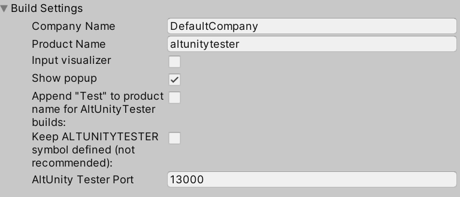
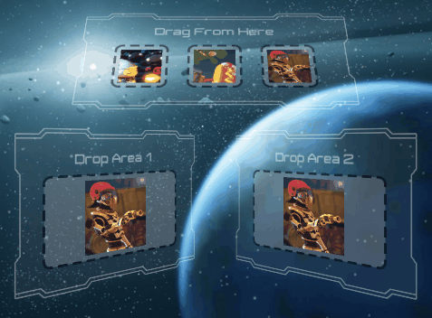
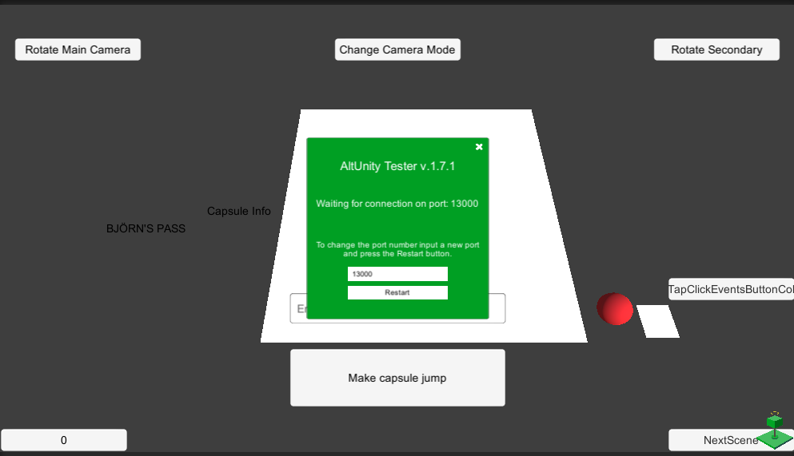

# AltUnity Tester Editor

The GUI refers to the "AltUnityTesterEditor" window that is displayed when adding the altUnity Tester package in Unity.


In the following sections you can see a breakdown of all the sections in the GUI.

## Tests List


-   displays all the available tests from the project folder
-   user can select what tests to run by checking the checkbox next to their name
-   user can either check each test individually or check the whole class of tests
-   tests that passed have a green checkmark while tests that failed are shown with a red x icon
-   Test Log Summary: contains a log for why a test has failed (see right side of screenshot)

## Build Settings



<!-- 
-   Proxy host

    Refers to the host the AltUnity Proxy is listening on.  
     You can change this value and make a new game build if you want to use another host.

-   Proxy port

    Refers to the port the AltUnity Proxy is listening on.  
     You can change this value and make a new game build if you want to use another port.
-->
-   *AltUnity Tester Port*

    The port the AltUnity Tester is listening on inside the running instrumented Unity App.  

-   *Company Name*

    Company name used for the game build (same with Unity's Player Settings)

-   *Product Name*

    The product name (same with Unity's Player Settings)

-   Input visualizer

```eval_rst
    | Lets you see where on screen an action (e.g. swipe or click) happens.
    | The action position is marked on the screen with a red circle.
```


To activate this option before build check the "Input visualizer" checkbox.

| Input Visualizer Disabled                          | Input Visualizer Enabled                       |
| -------------------------------------------------- | ---------------------------------------------- |
|  |  |

You can also activate this option from within the test using the following code:

```eval_rst
.. tabs::

    .. code-tab:: c#

        altUnityDriver.FindObject (By.NAME, "AltUnityRunnerPrefab").SetComponentProperty("AltUnityRunner", "ShowInputs", "true");
    .. code-tab:: java

        altUnityDriver.findObject (AltUnityDriver.By.NAME,"AltUnityRunnerPrefab").setComponentProperty("AltUnityRunner", "ShowInputs", "true");


    .. code-tab:: py

        self.altUnityDriver.find_object (By.NAME,"AltUnityRunnerPrefab").set_component_property("AltUnityRunner", "ShowInputs", "true")
```

-   *Show popup*

```eval_rst
    | If this option is checked, it will display the "AltUnityTester" popup in game containing the text "Waiting for connection on port 13000".
    | That means the build contains the AltUnity Tester.
    | Popup will disappear once the tests are started.
```



-   *Append "Test" to product name for AltUnity Tester builds*

    Will add "Test" to the product name

-   *Keep ALTUNITYTESTER symbol defined*  

    Will add "ALTUNITYTESTER" to the scripting define symbols. This is usually done automatically when entering in playmode or building the application. This option is not recommended if you are developing your application but can be used if you are on a branch where you only write tests.


## Scene Manager


-   The Scene Manager pane displays a list of the Scenes from your Project. Checked scenes are included in the build.
-   Unity uses the list of Scenes to determine the order that it loads the Scenes in. To adjust the order of the Scenes use the action buttons associated to each scene to move them up or down the list.
-   Display scene full path: displays the full path where the scenes are located
-   Add Scene: displays all the scenes in the project. User can add scenes to the "Scene Manager" from the "Add Scene" popup
-   Action buttons (add / select / remove scenes)


## Port Forwarding

    In this section you can setup [Port Forwarding](advanced-usage.html#what-is-port-forwarding-and-when-to-use-it) on your device.  
     Your device needs to be connected to the computer through USB and you need to click the Refresh button in the section to view it in the list.

## Build & Run Settings

_Platform Settings_

```eval_rst
.. tabs::

    .. tab:: Platform

        .. tabs::

            .. tab:: Android

                .. image:: ../_static/images/platformSettings/AltUnityWindowAndroid.png


                The **Android Bundle Identifier** field: fill in a valid bundle ID.

                The **Build Location** field: The build path for the instrumented Unity application.

                    - By default, the Output Path is a folder with the same name as your game.
                

            .. tab:: iOS

                .. image:: ../_static/images/platformSettings/AltUnityWindowiOS.png

                The **iOS Bundle Identifier** field: fill in a valid bundle ID.

                The **Signing Team ID** field:  fill in with the team's ID.

                The **Automatically Signed** field: check this for default signing.


                The **Build Location** field: The build path for the instrumented Unity application.

                    - By default, the Output Path is a folder with the same name as your game.

            .. tab:: Editor

                .. image:: ../_static/images/platformSettings/AltUnityWindowEditor.png

            .. tab:: Standalone

                .. image:: ../_static/images/platformSettings/AltUnityWindowStandalone.png

                The **Build Target** filed: choose build mode according to platform.

                The **Build Location** field: The build path for the instrumented Unity application.

                    - By default, the Output Path is a folder with the same name as your game.

```


_Build Settings_


    * Build Only

_Run Settings_

    * Play in Editor
    * Build & Run

_Run Tests Settings_

    * Run All Tests
    * Run Selected Tests
    * Run Failed Tests

```eval_rst
.. note::
    Run Tests does not use the options set in the Platform section.
```
