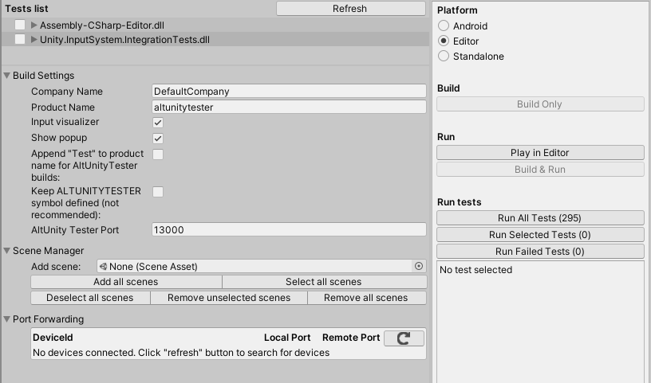
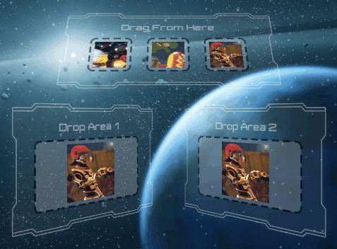

# AltUnity Tester Editor

The GUI refers to the "AltUnityTesterEditor" window that is displayed when adding the altUnity Tester package in Unity.



In the following sections you can see a breakdown of all the sections in the GUI.

## Tests List


* displays all the available tests from the project folder
* user can select what tests to run by checking the checkbox next to their name
* user can either check each test individually or check the whole class of tests
* tests that passed have a green checkmark while tests that failed are shown with a red x icon
* Test Log Summary: contains a log for why a test has failed (see right side of screenshot)

## Build Settings


* Output Path: file name or path of the game for a game build
* Company Name: company name used for the game build (same with Unity's Player Settings)
* Product Name: the company name (same with Unity's Player Settings)
* Input visualizer

```eval_rst
    | Lets you see where on screen an action (e.g. swipe or click) happens. 
    | The action position is marked on the screen with a red circle.
```
To activate this option before build check the "Input visualizer" checkbox.



You can also activate this option from within the test using the following code:

```eval_rst
.. tabs::

    .. code-tab:: c#

        altUnityDriver.FindObject (By.NAME, "AltUnityRunnerPrefab").SetComponentProperty("AltUnityRunner", "ShowInputs", "true");
    .. code-tab:: java

        altUnityDriver.findObject (AltUnityDriver.By.NAME,"AltUnityRunnerPrefab").setComponentProperty("AltUnityRunner", "ShowInputs", "true");


    .. code-tab:: py

        self.altdriver.find_object (By.NAME,"AltUnityRunnerPrefab").set_component_property("AltUnityRunner", "ShowInputs", "true")
```

* Show popup

```eval_rst
    | If this option is checked, it will display the "AltUnityTester" popup in game containing the text "Waiting for connection on port 13000". 
    | That means the build contains the AltUnity Tester. 
    | Popup will disappear once the tests are started.
```


* Append "Test" to product: will add "Test" to the product name

## Scene Settings


* Display scene full path: displays the full path where the scenes are located
* Add Scene: displays all the scenes in the project. User can add scenes to the "Scene Manager" from the "Add Scene" popup
* Action buttons (add / select / remove scenes)


## Server Settings


* Request separator: character used for separating altUnityDriver requests
* Request ending: character used for ending altUnityDriver requests
* Server port
* Port Forwarding 

## Platform Settings

``` sidebar:: screenshot

    .. image:: ../_static/images/altUnityTesterWindow/PlatformSettings.png
        :scale: 60 %
        :alt: platform settings image
        :align: center
        :target: `Platform Settings`_
```

* Platform 
    * Android / iOS / Editor / Standalone

* Build
    * Build Only

* Run
    * Play in Editor
    * Build & Run 

* Run Tests
    * All / Selected / Failed Tests from Test List 
    
```eval_rst
.. note::
    Run Tests does not use the options set in the Platform section.
```
