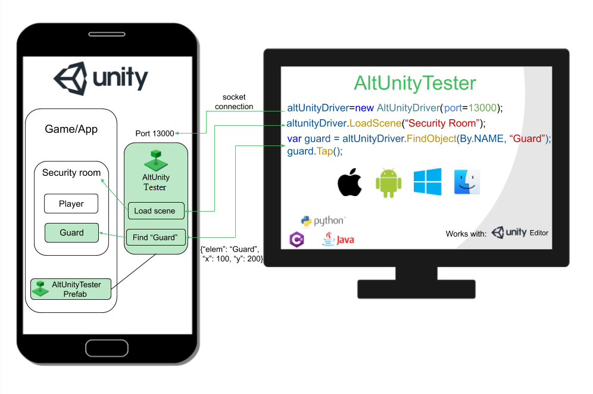

# Overview 

AltUnity Tester is an open-source UI driven test automation tool that helps you find objects in your Unity application and interact with them using tests written in C#, Python or Java.  
You can run your tests on real devices (mobile, PCs, etc.) or inside the Unity Editor. 

## Key features 

- find elements and get all their (public) properties: coordinates, text, values, Unity components, etc. 
- use and modify any of the (public) methods and properties of a Unity element
- simulate any kind of device input  
- manipulate and generate test data 
- get screenshots from your Unity Game 
- instrument your game and run C# tests from within the Unity Editor using the AltUnity Tester window
- run C#, Python or Java tests using your favourite IDE and against the game running on a device or inside the Unity Editor
- integrate with Appium tests for the ability to interact with native elements
- visualize input actions during test execution 
- see test results and reports inside the Unity Editor

## How it works 

AltUnity Tester framework contains the following modules:

* AltUnity Driver
* AltUnity Tester Editor Window
<!--
* AltUnity Proxy
-->

AltUnity Tester is used to instrument your Unity App to expose access to all the objects in the Unity hierarchy. The instrumented Unity App opens up a TCP socket connection on the device running the Unity application and waits for an AltUnity Driver to connect after starting the application.

AltUnity Driver module is used to connect to the instrumented Unity App, access all the Unity objects and interact with them through tests written in C#, Java or Python.

AltUnity Tester Editor Window is the GUI used for instrumenting a Unity game and running C# tests directly from Unity Editor.

<!--
AltUnity Proxy module is used to create the bridge between the tests and the instrumented Unity App. It acts as a webscoket server that facilitates communication between AltUnity Driver (tests) and AltUnity Tester (instrumented Unity app).
-->

