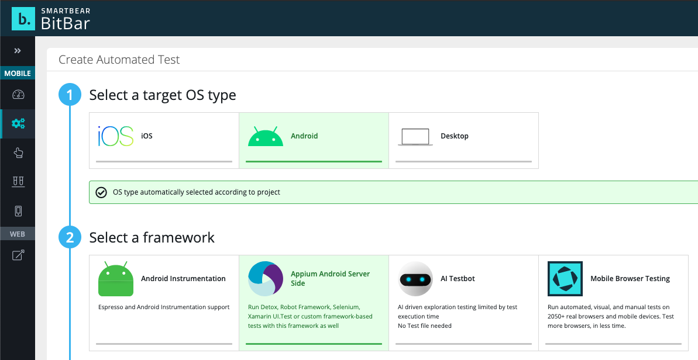
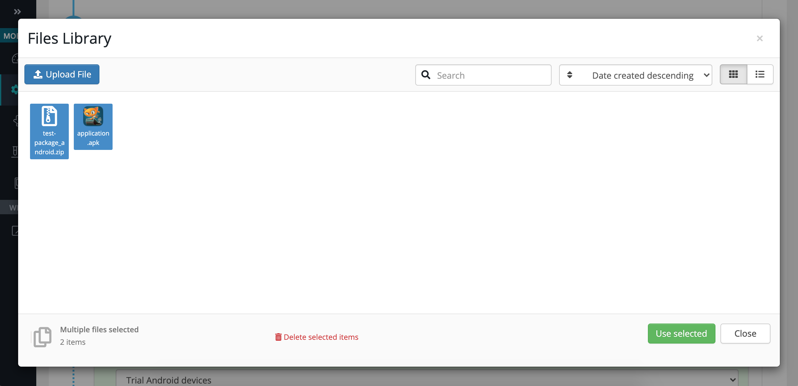

# Running tests using device cloud services

In some cases you might want to run your tests on dozens or even hundreds of real devices, to test the compatibility of your app on many different device models and OS versions. There are multiple device farms which will enable you to do so, without having to own the devices yourself.

Some of these cloud services allow running Appium automated tests by giving you access to an Appium server running in the cloud that has access to all their mobile devices. These services will not work with AltUnity Tester. 

If your tests are running locally, on your machine, and the device is running in the cloud, your local tests cannot communicate with the TCP socket that AltUnity Tester opens on a specific port inside the device. That's because AltUnity Tester requires you to configure your port forwarding from the device to the machine running the tests.  

However, some of these cloud services give you access to a virtual machine or a Docker container that has a cloud device attached, where you upload your tests, configure your environment and run your tests. This means you can configure your port forwarding so that the tests can connect to the TCP socket opened by AltUnity Tester inside the game running on the device.

So far, we know that **AWS Device Farm** and **Bitbar Cloud** both offer this type of "server-side" running, so they both support running AltUnity tests. If you know of any other device cloud providers that might support this, please let us know and we will try them out. 

## BitBar Cloud

BitBar Cloud is a platform that provides access to hundreds of real iOS and Android devices. It supports client side test execution, but also server-side test execution which we need in order to make AltUnity work.

You can create a free account at <https://cloud.bitbar.com> and try out the test examples detailed below for yourself.

In order to run tests on the BitBart Cloud, you will first need to create two files: 

* **.ipa** (for iOS) / **.apk** (for Android) file, with a build of your app containing the AltUnity driver; 

If you’re unsure how to generate an **.ipa** file please watch the first half of [this video](https://www.youtube.com/embed/rCwWhEeivjY?start=0&end=199) for iOS.
After you finish setting up the build, you need to use the **Archive** option to generate the standalone **.ipa**. The required steps for the archive option are described [here](https://wiki.saucelabs.com/display/DOCS/Creating+an+ipa+File#CreatinganipaFile-Buildingan.ipaFile). Keep in mind that you need to select **Development** at step 6.


* **.zip** file containing your tests and a script that defines how those tests will be run. 
For more details about the content of this file please see the BitBar documentation [here](https://docs.bitbar.com/testing/scripted-run/)

```eval_rst
.. note::
   Please note that the `run-tests.sh` script that runs the tests needs to be at the root of the unzipped package. This means that your zipping method should not create an extra folder when compressing everything together.
```

### BitBar project example

You can download our example BitBar project [here](https://gitlab.com/altom/altunity/examples/alttrashcat-tests-python-bitbar).
It contains a pre-built ***ipa*** and ***apk*** file, so you can try out running tests on both Android and iOS

**Steps to run the tests on BitBar:**
1. From the cloned repository, run the *`create-bitbar-package.sh <ios|android>`* script, choosing your desired os as a parameter. This will create a **.zip** file, containing all the files required to execute the tests;

2. On BitBar, create a new project, and Select a target OS type (Android in our example) and a framework (Appium Server Side); 
  

3. Upload the application file (**.apk** or **.ipa**) and the **.zip** file. Please make sure to highlight both before clicking on *"Use selected"*. 
  


    By default, the selected action for the zip file should be *“Use to run the test”* and for the app file *“Install on the device”*. If not, use the dropdown lists to select them. 
      

4. If you are using a free account, leave the *“Use existing device group”* option checked, together with *“Trial Android devices”* selected. If you have a subscription, please see the BitBar Cloud documentation [here](https://docs.bitbar.com/testing/user-manuals/device-groups) for more info about creating your own device groups;  

5. You can now create and run your automated tests.


Going back to the projects tab will allow you to monitor the progress of your tests and also show an overall status once the tests are done. Selecting an individual device will show you specific results for that device, as well as providing video recording of your test run.


## AWS Device Farm

Amazon offers another great alternative to cloud mobile testing, in the form of [**AWS Device Farm**](https://docs.aws.amazon.com/devicefarm/index.html). You can register for free and get a 1000 device minutes trial period (a credit card will be required for registration).

``` note::
    We encountered some problems forwarding the port on iOS devices. This why we only talk about running tests on Android devices. We will update this page and the sample project once we have a solution for iOS.
```


Just like with BitBar, you will need two files in order to run your tests:

* **.apk** file, with a build of your app containing the AltUnity driver; 
* A **.zip** file containing your tests.

### AWS Device Farm project example

You can download our example project [here](https://gitlab.com/altom/altunity/examples/alttrashcat-tests-python-aws).
It contains a pre-built ***apk*** file, so you can try out running tests on Android

**Steps to run the tests on AWS:**
1. From the cloned repository, create a **.zip** file containing the `requirements.txt` file, the `tests` folder and the `pages` folder. Make sure to place all of them in the root directory;
2. On AWS, create a new project, make sure you are on the *"Automated tests"* tab and then select *"Create a new run"*;
3. At the next step, choose the *"Test a native application on Android devices."*. Then upload your **.apk** file;
4. At the configuration step, choose *"Appium Python"* for the purpose of this example, then upload the **.zip** file containing the tests;
5. The demo project contains an example **.yml** configuration file. Use is at the next step, by selecting *"Run your test in a custom environment"*. This will define how your test environment is set up and how the tests run;
6. The next step will allow you to select on which devices the tests will be executed. You can create your own device pool, or use the recommended top devices;
7. For this example, no changes need to be done to the Device state configuration;
8. At the last step, you can set the execution timeout for your devices, then start the tests.


Again, the project screen will show an overall status of the tests execution progress and results. Selecting individual runs and devices will give detailed logs about the tests, together with a video recording of the run itself.